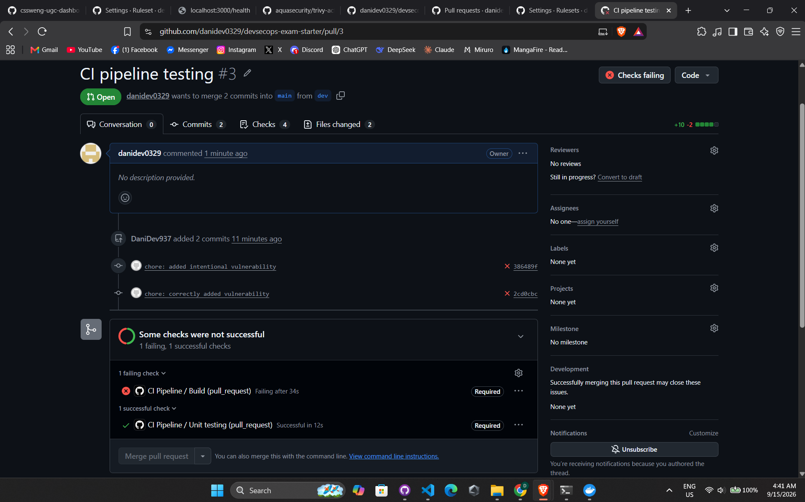
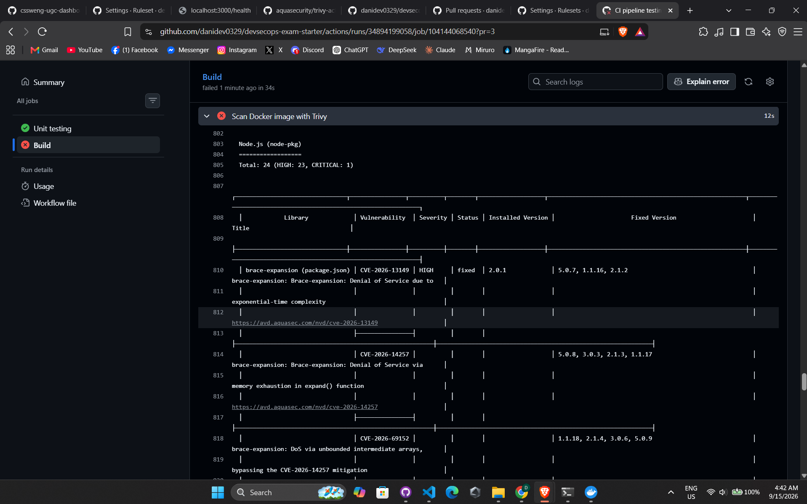

# Macky Merch API - DevSecOps Starter

This is the starter repository for the **LSCS DevSecOps Engineering Take-Home Exam**. 

## Getting Started Locally
1. Install dependencies:
   ```bash
   npm install
   ```
2. Run the development server:
   ```bash
   npm start
   ```
3. Run the test suite:
   ```bash
   npm test
   ```

*The server will run on `http://localhost:3000`. You can verify the health endpoint at `http://localhost:3000/health`.*

### Run with Docker

1. Build the Docker image:
   ```bash
   docker build -t express-health-app .
   ```
2. Run the container and map port 3000:
   ```bash
   docker run -p 3000:3000 express-health-app
   ```
3. Verify the health endpoint at `http://localhost:3000/health`.

### Run with Docker Compose

The `docker-compose.yml` file orchestrates the app together with its Postgres database. The database includes a healthcheck, and the app will only start once the database reports healthy.

1. Start the whole stack (builds the image too):
   ```bash
   docker compose up -d
   ```
2. Verify the app health endpoint at `http://localhost:3000/health`.
3. The Postgres database is reachable inside the network as `db` on port `5432` with the credentials defined in `docker-compose.yml`.
4. Stop the stack:
   ```bash
   docker compose down
   ```
   Add `-v` to also remove the persistent database volume:
   ```bash
   docker compose down -v
   ```

## Architectural Explanation

### Base Image: `node:20-alpine`

The Dockerfile uses `node:20-alpine` instead of `node:latest` for a few reasons:

- **Minimal footprint** — Alpine Linux is a musl-based, extremely small distribution (~5 MB), which keeps the final image size and attack surface low.
- **Long-Term Support (LTS)** — Node 20 is an actively maintained LTS release, receiving regular security patches. `node:latest` is an untagged, moving target that can change underneath you, making builds non-reproducible.
- **Reduced attack surface** — a full `node` image ships a full OS with far more installed packages, increasing the number of potential vulnerabilities.

### Multi-Stage Build

The `Dockerfile` uses a two-stage build to keep the final image as small and secure as possible:

1. **Build stage (`FROM node:20-alpine AS build`)** — copies only `package*.json`, installs production dependencies with `npm ci --omit=dev`, and nothing more. This stage contains npm (and its transitive dependencies), but is discarded after the build.
2. **Production stage** — starts from a fresh `node:20-alpine` image. It removes the bundled npm, then copies only the installed `node_modules` and application source from the build stage. Finally, it runs as the unprivileged `node` user (`USER node`).

This means the runtime image has no package manager, no source-manifest copies, and no root privileges — shrinking the image and eliminating tooling-only dependencies (such as the `tar` library bundled with npm) from the runtime attack surface.

### Security Scanner: Trivy

The pipeline uses **Trivy** (via `aquasecurity/trivy-action`) for container image scanning:

- **Open-source and fast** — it scans images in seconds and is widely adopted in the DevSecOps community.
- **Comprehensive vulnerability database** — it detects known CVEs in both OS packages and language-specific dependencies (including npm packages).
- **Native GitHub Action** — integrates directly into the workflow as a step.
- **Fail-fast gating** — configured with `severity: HIGH,CRITICAL` and `exit-code: 1`, so the build fails whenever high or critical vulnerabilities are present.

### Static Analysis: CodeQL

The repository also uses GitHub's native **CodeQL** (`github/codeql-action`) to statically analyze the source code for security flaws:

- **Analyzes the source, not the image** — unlike Trivy, CodeQL inspects the application code itself and flags security bugs such as SQL injection, path traversal, and unsafe deserialization.
- **Language-aware** — the workflow runs a `javascript-typescript` analysis automatically configured for this repo.
- **Runs on every push/PR** — `.github/workflows/codeql.yml` triggers on push and pull requests to `main`, plus a weekly scheduled scan.
- **Zero-trust gating** — alert results are published to the **Security** tab, and the job fails the check when a flaw is detected.

## Vulnerability Demonstration

To validate that the CI pipeline actually catches vulnerabilities,
`lodash` was intentionally changed to a known-vulnerable version
(4.17.15) in package.json.

The Trivy scan step in `.github/workflows/ci.yml` detected this
and failed the build with HIGH-severity findings:




This confirms the pipeline blocks merges/builds containing known
vulnerable dependencies. After confirming detection, lodash was
updated to a patched version (^4.17.21) and the pipeline passed.

## Challenges Faced

| Challenges | Work Around |
|------------------|------------------|
| I was not familiar about how to run docker as a non-root user | I researched it through youtube tutorials, then once I understood why is it important and how to do it, I implemented it into my code. |
| Confused on how to build a CI pipeline from scratch | Again, through youtube tutorials I learned that writing a ci pipeline just follows a set of steps, often called jobs, that it runs per check. With this and a syntax guide, I was able to create a ci.yml from scratch. |

